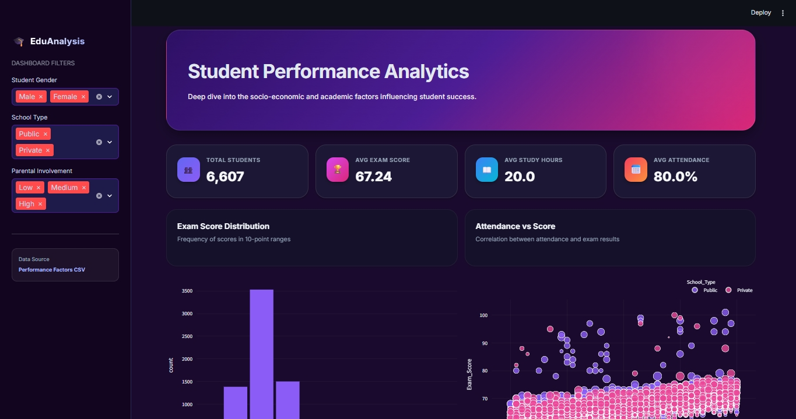
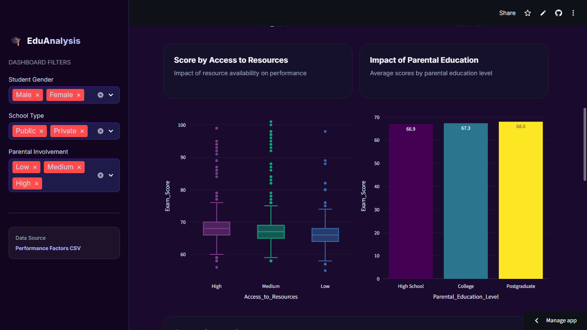

# Student Performance Analysis Dashboard

This project is a website (dashboard) that helps you understand how students are performing in their exams. It shows useful data like exam scores, study hours, and attendance in a very simple and beautiful way.

## What is this project?
Imagine you have data about many students – their marks, how much they study, and how often they come to school. This dashboard takes all that data and turns it into easy charts and graphs. It helps teachers and parents see what makes a student successful. You just need the data of the students in a csv file.




## Features (What specific things can you see?)
- **Total Students & Average Scores:** You can see the total number of students and their average marks at the top.
- **Study Hours & Attendance:** Check if studying more leads to better marks.
- **Comparisons:** Compare marks between Public and Private schools.
- **Parental Involvement:** See if parents helping their kids improves their scores.
- **Cool Dark Theme:** The website has a modern dark purple look which is very pleasing to the eyes.
- **Detailed Data:** At the bottom, you can see the full list of student details.


## How to Run this Project on your Computer

Follow these simple steps to run this dashboard:

1.  **Install Python:** Make sure Python is installed on your computer.
2.  **Install Libraries:** Open your terminal (command prompt) and type this command to install the required tools:
    ```bash
    pip install streamlit pandas plotly
    ```
3.  **Run the App:** After installing, type this command in the terminal inside the project folder:
    ```bash
    streamlit run app.py
    ```
4.  **Open in Browser:** The app will automatically open in your web browser.

## Technical Details for Students (How it works)

Since this is a college project, here is a simple explanation of how the Python code turns into a website. We use three main "Magic Tools" (Libraries):

### 1. Streamlit (`import streamlit as st`)
*   **What it does:** It basically turns your Python script into a website.
*   **How it works:** Normally, to build a website, you need to learn HTML, CSS, and JavaScript. But with Streamlit, you just write Python functions.
    *   When you write `st.title("Hello")`, Streamlit automatically creates an `<h1>` HTML tag in the background and shows it on the browser.
    *   It handles all the frontend design so you can focus on the logic.

### 2. Pandas (`import pandas as pd`)
*   **What it does:** This is "Excel for Python".
*   **How it works:** We use it to read the `csv` file (which is just like an Excel sheet).
    *   It loads the data into a table called a "DataFrame".
    *   We use it to filter data (e.g., "Show me only Male students") and calculate averages.

### 3. Plotly (`import plotly.express as px`)
*   **What it does:** It draws the colorful charts.
*   **How it works:** We give the Pandas data to Plotly, and it creates interactive graphs (you can zoom in, hover over points, etc.). Streamlit then displays these graphs using `st.plotly_chart()`.

### The Flow
1.  **Input:** Python reads the `data.csv` file.
2.  **Process:** Pandas cleans and filters the data.
3.  **Visualization:** Plotly draws the charts based on that data.
4.  **Output:** Streamlit puts everything (Text, Charts, Tables) together on a webpage.

---

### Access to the Project
You can access the project at [https://student-performance-analysis-3qxazpfffanfstwdhvknso.streamlit.app/].


